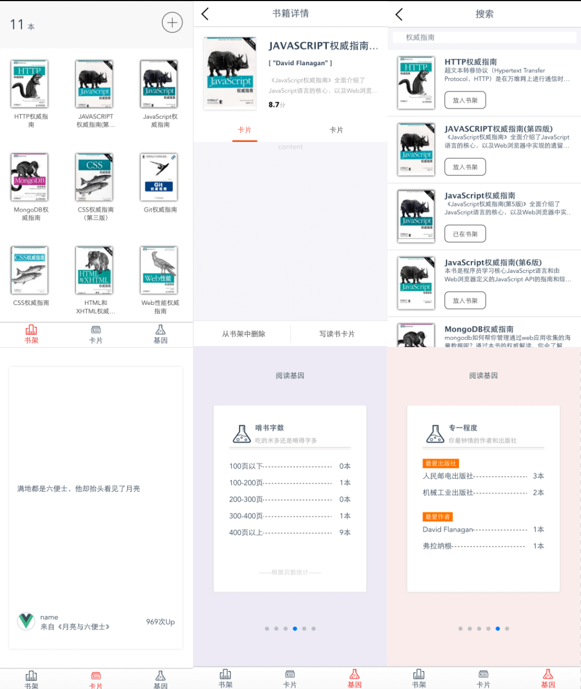

# vue-bookshelf

> A Vue.js project for bookshelf

## Build Setup

``` bash
# install dependencies
npm install

# serve with hot reload at localhost:8080
npm run dev

# build for production with minification
npm run build

# build for production and view the bundle analyzer report
npm run build --report
```

一直想做个记录读过书的应用

偶然发现微信小程序有个叫做“口袋书架”应用

喜欢的不得了

所以模仿着用vuejs做了一个

也许有些地方看起来和原版不一致

那是我累了

临时先占着位

后面慢慢迭代

- 技术栈
    - vuejs
    - vue-router
    - vuex
    - vue-awesome-swiper
    - less


喜欢就star吧
